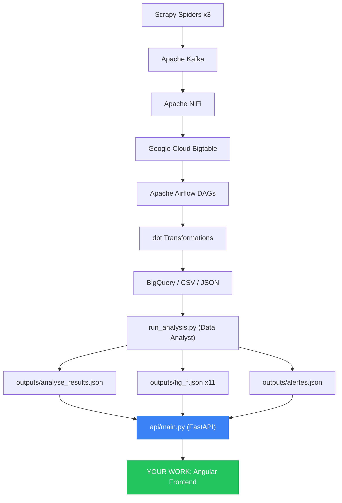

# 🔍 Full Project Analysis — Price Intelligence Platform V2

## 1. Project Overview

This is an **academic project** (Prof. Elaachak 2025-2026) with **4 team roles**: Data Engineer, Data Analyst, Fullstack Developer, and DevOps. The platform monitors furniture prices across 3 Moroccan e-commerce sites (**Ikea**, **Jumia**, **Kitea**).

**Your role is Fullstack Developer** — you need to build a web dashboard (Angular + FastAPI) that consumes the existing API.

---

## 2. Architecture Map



---

## 3. What Is Already Done (By Other Team Members)

### ✅ Data Engineering (`dataengineer/`)

| Component | File | Status |
|-----------|------|--------|
| Scrapy Spiders | `dags/jumia_dag.py`, `ikea_dag.py`, `kitea_dag.py` | ✅ Done |
| Kafka Producer | `kafka_producer.py` | ✅ Done |
| Docker Compose | `docker-compose.yml` (Zookeeper, Kafka, NiFi, Airflow, Bigtable emulator) | ✅ Done |
| Airflow DAGs | `bigtable_pipeline_dag.py`, `data_analyst_dag.py`, `weekly_report_dag.py` | ✅ Done |
| dbt Models | `dbt/jumia_dbt/` | ✅ Done |
| GCP Credentials | `diesel-patrol-491520-j8-16dd83a23f21.json` | ✅ Present |

### ✅ Data Analyst (`prix_intelligence/`)

| Component | File | Status |
|-----------|------|--------|
| Analysis Notebook | `notebooks/analyse_prix_intelligence.ipynb` (5.6 MB, 58 cells) | ✅ Done |
| Standalone Analysis Script | `run_analysis.py` (848 lines, 15 analysis steps) | ✅ Done |
| PDF Report Generator | `generer_rapport.py` (687 lines, 7-page PDF) | ✅ Done |
| Streamlit Dashboard | `dashboard/app.py` (1,194 lines, 7 tabs) | ✅ Done |
| **FastAPI Backend** | **`api/main.py`** (238 lines, **18 endpoints**) | ✅ **Done — This is what you consume** |
| Tests (pytest) | `tests/test_api.py` + `test_data.py` (78 tests) | ✅ Done |
| Dockerfile | `Dockerfile` | ✅ Done |

### ✅ Data Outputs (Pre-generated)

| File | Size | Description |
|------|------|-------------|
| `data/clean/clean_prices.csv` | 935 KB | 2,647 cleaned products |
| `data/raw/historique_prices.csv` | 10 MB | 106,650 rows, 30 days history |
| `data/raw/json_*.json` | ~1.5 MB | Raw scraped data per site |
| `outputs/analyse_results.json` | 122 KB | **21 analysis sections** (stats, tests, ML, alerts) |
| `outputs/alertes.json` | 37 KB | 100 price alerts |
| `outputs/fig_*.json` | 11 files | Pre-built Plotly chart configs |
| `outputs/ml_results.json` | 1.2 KB | Random Forest results |
| `outputs/rapport_*.pdf` | 440 KB | Auto-generated 7-page PDF report |
| `outputs/chart_*.png` | 7 images | Static chart images for the PDF |

---

## 4. The FastAPI Backend — Your Data Source

The API at [api/main.py](file:///c:/Users/AYOUB/Desktop/price-intelligence-platform_V2/prix_intelligence/api/main.py) is fully built and provides **18 endpoints**:

### How to Run It
```bash
cd prix_intelligence/api
python main.py
# → http://localhost:8000
# → http://localhost:8000/docs  (Swagger interactive docs)
```

> [!IMPORTANT]
> If you get "socket already in use", the server is already running from a previous session. Either kill it first or just use it.

### Endpoint Summary

| Category | Endpoints | What They Return |
|----------|-----------|-----------------|
| **Stats** | `/stats`, `/stats/categories`, `/stats/sites` | Mean, median, std, min, max per site/category |
| **Tests** | `/tests`, `/regression` | Shapiro-Wilk, Kruskal-Wallis, Mann-Whitney, OLS regression |
| **Confidence** | `/intervalles-confiance`, `/intervalles-confiance/categories` | 95% CI per site and category |
| **Power** | `/power-analysis` | Cohen's d, statistical power |
| **Time Series** | `/evolution`, `/velocity`, `/anomalies` | 30-day price evolution, trends, anomalies |
| **Alerts** | `/alertes?priorite=HAUTE&site=ikea&type_alerte=BAISSE_FORTE` | 100 intelligent alerts with filters |
| **Segments** | `/segmentation`, `/correlation` | Price tiers, Spearman correlation matrix |
| **Charts** | `/figures`, `/figure/{name}` | 11 pre-built Plotly JSON configs (ready to render) |

> [!TIP]
> The `/figure/{name}` endpoints return **complete Plotly JSON** that can be rendered directly with `Plotly.newPlot(div, fig.data, fig.layout)` — no chart-building logic needed on the frontend!

### Available Plotly Charts (via `/figure/{name}`)

| Chart Name | What It Shows |
|------------|---------------|
| `boxplot` | Price distribution per site & category |
| `barchart` | Average price per category & site |
| `evolution` | 30-day price trend lines |
| `scatter` | Current price vs old price |
| `kde` | KDE density distribution |
| `ic` | 95% confidence intervals |
| `correlation` | Spearman correlation heatmap |
| `velocity` | Price velocity (trend) |
| `segmentation` | Price tier distribution |
| `feature_importance` | ML feature importance |
| `ml_predictions` | Predicted vs actual price |

---

## 5. What Is Missing — YOUR Work

> [!CAUTION]
> The only piece missing from this entire platform is the **Fullstack Web Dashboard** — that's your deliverable.

The [LIVRAISON_FULLSTACK.md](file:///c:/Users/AYOUB/Desktop/price-intelligence-platform_V2/prix_intelligence/LIVRAISON_FULLSTACK.md) file is essentially the **handoff document from the Data Analyst to you**. It contains JavaScript code examples for every endpoint.

### What You Need to Build

An **Angular** application that:

1. **Connects to `http://localhost:8000`** (the existing FastAPI)
2. **Displays KPIs**: Product count, average price, promo rate, alert count
3. **Renders Plotly Charts**: Use the `/figure/{name}` endpoints for instant charts
4. **Shows Alerts Table**: Filterable list from `/alertes`
5. **Displays Statistical Tests**: Shapiro-Wilk, Kruskal-Wallis results from `/tests`
6. **Shows Price Evolution**: Time-series from `/evolution` and `/velocity`
7. **Segmentation View**: Price tiers from `/segmentation`

---

## 6. Key Data Points (for your UI)

| Metric | Value |
|--------|-------|
| Products analyzed | 2,647 (after cleaning) |
| Sites | 3 (Ikea, Jumia, Kitea) |
| Categories | 5 (Salon, Chambre, SAM, Rangement, Mobilier Pro) |
| History | 30 days, 106,650 observations |
| Products on sale | ~55% |
| Active alerts | 100 (52 drops + 48 rises) |
| Avg price Ikea | 4,230 MAD |
| Avg price Kitea | 3,190 MAD |
| Avg price Jumia | 1,306 MAD |
| ML R² (Random Forest) | 0.48 |
| OLS R² | 0.19 |

---

## 7. Summary — What Should We Do?

Tell me what you'd like to do next. Here are the options:

1. **Build the Angular frontend** — Create the full dashboard app consuming the FastAPI
2. **Fix/modify the existing API** — Add new endpoints, change data formats, etc.
3. **Work on the data pipeline** — Modify scrapers, analysis, reports
4. **Something else entirely** — Your call!

Just tell me what to do and I'll execute it.
